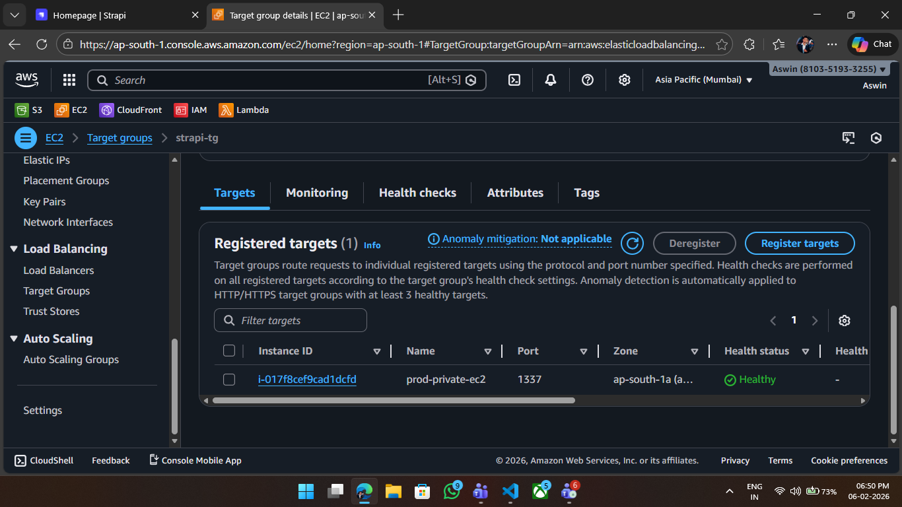
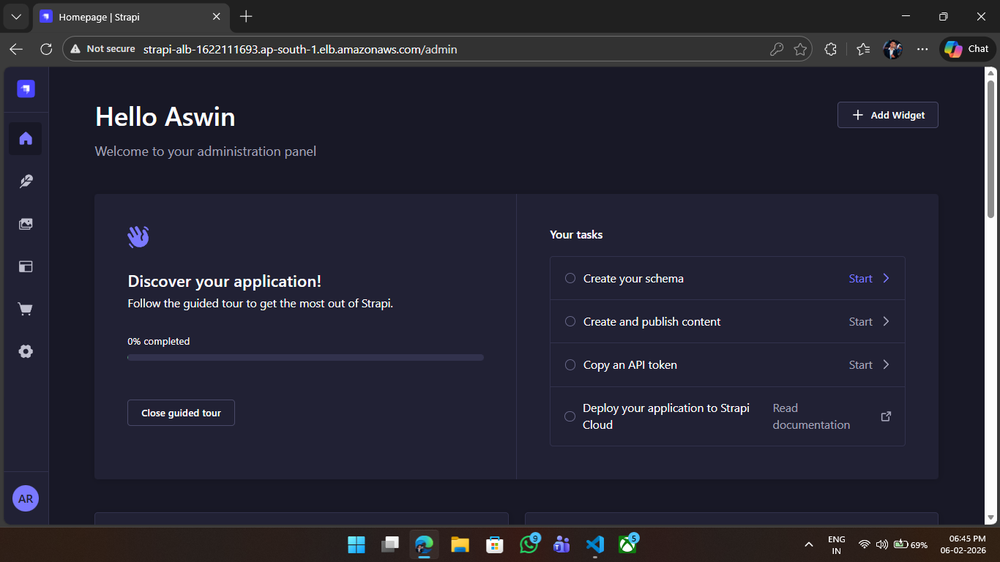
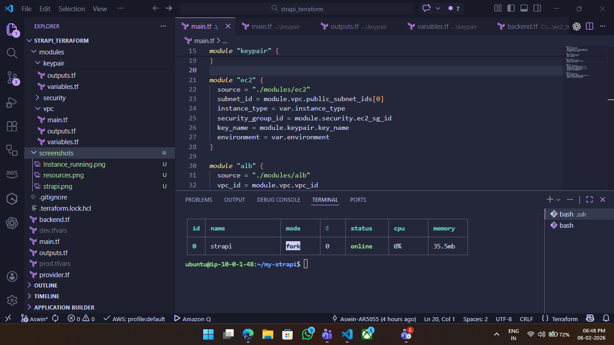

# Terraform Deployment: Private EC2 with ALB + Strapi

## 📌 Project Overview

This project provisions infrastructure on AWS using Terraform modules to
deploy:

-   A custom VPC
-   Public and Private Subnets
-   Internet Gateway
-   NAT Gateway (for outbound internet from private subnet)
-   Application Load Balancer (ALB) in public subnet
-   Private EC2 instance
-   Security Groups for access control
-   Remote S3 backend for Terraform state
-   Strapi application running on EC2 (managed using PM2)

------------------------------------------------------------------------

## Screenshots

### ALB Target Group Health


### Strapi Admin Panel


### pm2 status


### Resources (I forgot to screenshot terraform apply resource creation output so i attached screenshot of terraform state list)


### Instance running on AWS console


------------------------------------------------------------------------

## 🏗️ Architecture

User → ALB (Public Subnet) → Target Group → EC2 (Private Subnet) →
Strapi (Port 1337)

-   ALB handles public traffic (Port 80)
-   EC2 instance remains private
-   NAT Gateway allows EC2 outbound internet access
-   Security groups restrict access properly

------------------------------------------------------------------------

## 🛠 Terraform Modules Used

### 1️ VPC Module

-   Creates VPC
-   Creates 1 Public Subnet
-   Creates 1 Private Subnet
-   Internet Gateway
-   NAT Gateway
-   Route Tables & Associations

### 2️ Security Module

-   ALB Security Group (Allow HTTP from 0.0.0.0/0)
-   EC2 Security Group
    -   Allow SSH from my public IP
    -   Allow port 1337 from ALB security group

### 3️ EC2 Module

-   Private EC2 instance
-   Security group attached

### 4 KeyPair Module

-   Creates a Key Pair for EC2 access

### 4️ ALB Module

-   Application Load Balancer (Public)
-   Target Group (Port 1337)
-   Listener (Port 80 → Target Group)

### 5️ Backend

-   S3 bucket for Terraform remote state
-   State locking enabled (if DynamoDB configured)

------------------------------------------------------------------------

## Strapi Deployment Process

Strapi was installed manually inside EC2 due to CLI interactivity issues
in automation.

### Steps Performed:

1.  SSH into EC2
2.  Install Node.js (v20)
3.  Create Strapi project:

``` bash
npx create-strapi-app@latest my-strapi --quickstart
```

4.  Edit `vite.config.js` to allow external host access

5.  Install PM2

``` bash
npm install -g pm2
```

6.  Start Strapi using PM2

``` bash
pm2 start npm --name "strapi" -- start
```

7.  Confirm process is running

``` bash
pm2 status
```

------------------------------------------------------------------------

## 🔐 Security Configuration

### ALB Security Group

-   Allow HTTP (80) from 0.0.0.0/0

### EC2 Security Group

-   Allow SSH (22) from personal IP
-   Allow 1337 from ALB security group only

------------------------------------------------------------------------

## 🧪 Health Check Configuration

Target Group: - Protocol: HTTP - Port: 1337 - Health Check Path: / -
Success Code: 200

------------------------------------------------------------------------

## ⚠️ Issues Faced & Resolutions

### 1. Strapi CLI Interactive Prompts

Strapi CLI required login interaction which broke automation via
user_data. Solution: Installed Strapi manually.

### 2. 502 Bad Gateway

Caused by: - App not running - Incorrect health check path - Docker
permission issues (initial attempt)

Resolved by: - Running Strapi using PM2 - Ensuring app listens on
0.0.0.0:1337

### 3. S3 Backend Error

DNS resolution issue due to region mismatch. Verified bucket region
using AWS CLI.

------------------------------------------------------------------------

## 📂 Final Working State

-   Terraform successfully provisions infrastructure
-   EC2 is private
-   ALB is public
-   Target group healthy
-   Strapi accessible via ALB DNS
-   PM2 ensures application persistence

------------------------------------------------------------------------

## 📌 Lessons Learned

-   Avoid interactive CLI tools in user_data
-   Build application images before deployment in production scenarios
-   Always check cloud-init logs at:

```{=html}
<!-- -->
```
    /var/log/user-data.log

-   Debug ALB issues via:
    -   Target group health status
    -   Security group rules
    -   Application logs

------------------------------------------------------------------------


**Author:** Aswin Raj\
**Environment:** AWS ap-south-1\
**Provisioning Tool:** Terraform\
**Application:** Strapi CMS

------------------------------------------------------------------------
